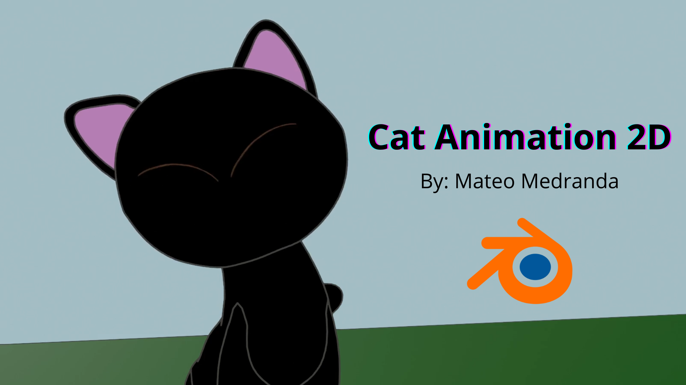

# 🎨 CAT animation project

Welcome to **CAT animation project**!  
This repository contains animations developed with [Blender].
--------------------------------------------------------------------------------------------------------

---

## 📸 Preview

### Example 1

### Example 2

> You can use `` or `` tags to insert images.  
> `` is useful if you want to resize images directly in Markdown.

---

## 🚀 Features

- Smooth real-time animations.  
- Works in modern browsers.  
- Modular and easy-to-read code.  
- Exportable to multiple formats.  

---

## 📂 Project Structure

